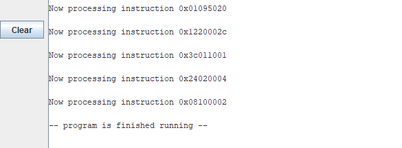
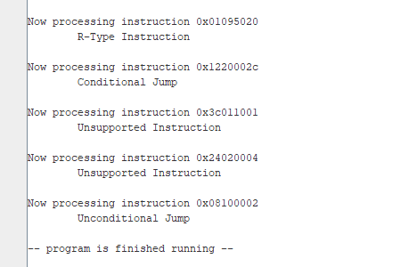
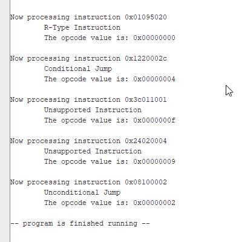

# MIPS Programming Assignment 5

- [MIPS Programming Assignment 5](#mips-programming-assignment-5)
	- [Practice Programs](#practice-programs)
	- [Purpose](#purpose)
	- [Skills and Knowledge](#skills-and-knowledge)
	- [Task 1: Loop over array of values](#task-1-loop-over-array-of-values)
		- [Sample Output Task 1](#sample-output-task-1)
	- [Task 2: Parse MIPS Instruction](#task-2-parse-mips-instruction)
		- [Task 2: Procedure Algorithm Logic](#task-2-procedure-algorithm-logic)
		- [Test it in main](#test-it-in-main)
		- [Sample Output Task 2](#sample-output-task-2)
	- [Task 3: Process MIPS Instruction](#task-3-process-mips-instruction)
		- [Task 3: Procedure Algorithm Logic](#task-3-procedure-algorithm-logic)
		- [Test Process MIPS Instruction](#test-process-mips-instruction)
		- [Sample Output Task 3](#sample-output-task-3)
	- [Submission Checklist](#submission-checklist)
	- [Other Resources](#other-resources)
		- [Procedure Template](#procedure-template)
		- [Pseudocode in C](#pseudocode-in-c)
  
## Practice Programs

Make sure you save the practice program discussed in the lectures in the `la` folder of this project. 

## Purpose

The purpose of this assignment in to help you understand how to use procedures(functions) in MIPS that call other procedures. For that, we are going to parse some mips instructions and do some analysis with them.

## Skills and Knowledge

The goal of this lab is to practice the following skills:

1. Working with tables
2. Save registers to the **stack**
3. Nested Procedures
4. Working with multiple files

## Task 1: Loop over array of values

Your first task is to loop over the array of `words` representing `MIPS Instructions`. As you loop over the items, display their value using a message.  

Begin working in the file template (`ca.asm`) provided in the `ca` folder. To make your output messages more readable, use the `print_hex_info` provided in the starting code.  This procedure takes two input parameters, the first is the string to print, and the second the value.

Starting code:
```mips
# Data for the program goes here
.data
 process: .asciiz "\nNow processing instruction "
 newLine: .asciiz "\n"

 # number of test cases
 CASES: .word 5
 # array of pointers (addresses) to the instructions
 instructions: .word 0x01095020,   # add $t2, $t0, $t1
     .word 0x1220002C,    # beqz $s1, label
     .word 0x3C011001,  # lw $a0, label($s0)
     .word 0x24020004,  # li $v0, 4
     .word 0x08100002  # j label
# Code goes here
.text
main:
 # Task 1: Loop over the array of instructions

loop_array:
 #  Set registers and call: print_hex_info

 j loop_array  # end of loop
  

end_main:
 li $v0, 10  # 10 is the exit program syscall
 syscall   # execute call
############################################
```

### Sample Output Task 1



## Task 2: Parse MIPS Instruction

Your next task is to create a procedure called `decode_instruction`. Make sure you follow the template from [Procedure Template](#procedure-template).

This procedure will take the `MIPS Instruction` from [Task 1](#task-1-loop-over-array-of-values) as input argument. Your procedure should parse the `opcode` from the input parameter and return it to the caller for display. See [pseudocode sample](#pseudocode-in-c)

The procedure should have the following signature:

```mips
###############################################################
# Fetch instruction to correct procedure based on opcode for
# instruction parsing.
# Argument parameters:
# $a0 - input, 32-bit instruction to process (required)
# Return Value:
# $v0 - output, instruction opcode (bits 31-26) value (required)
# Uses: 
# $s0: for input parameter (required)
# $s1: for opcode value (required)
decode_instruction:
 # Save registers to Stack
 # ...

 # Your function "real" code begins here
 # ...

 # Isolate opcode (bits 31-26) 1111 1100 0000 0000 0000 0000 0000 0000

 # Task 3 (later): Set/Values call process_instruction_procedure

 # Set return value

end_decode_instruction:
 # Restore registers from Stack
 # ...

 jr $ra
```

Note that this procedure will eventually call other procedures. For this reason, make sure you allocate some space in the `stack` and save all the required registers. You may follow the [Procedure Template](#procedure-template).

### Task 2: Procedure Algorithm Logic

The instruction's opcode comes in the 6 most significant bits of the address (31-26).

1. Save input parameters `$a0 and $a1` into `$s0, and $s1`.
2. Isolate opcode (bits 31-26) 1111 1100 0000 0000 0000 0000 0000 0000
3. Right shift 26 positions the opcode.
4. Set return register `$v0` with value.

### Test it in main

```mips
# Data for the program goes here
.data
 # ...
 opcode_num: .asciiz "\tThe opcode value is: "

# Code goes here
.text
main:
 # ...
loop_array:
 #  Set registers and call: print_hex_info for process string

 # Task 2:
 #  Set registers and call: decode_instruction

 #  Set registers and call: print_hex_info for opcode_num string

 # ...
 j loop_array  # end of loop

end_main:
  li $v0, 10  # exit program syscall
  syscall

## end of ca.asm
```

### Sample Output Task 2



## Task 3: Process MIPS Instruction

Your next task is to create another procedure called `print_opcode_type`. This procedure will take the `MIPS Instruction opcode` from [Task 2](#task-2-parse-mips-instruction) as input parameter. Your procedure should display the corresponding instruction type string based on the input.

 For this assignment, you are only required to support `branches` and `R-type` instructions. Any other value for the opcode should display `Unsupported Instruction`. Your code should support the following choices:

| Opcode | Instruction Type        |
|--------|-------------------------|
| 0      | R-Type Instruction      |
| 2 or 3 | Unconditional Branch    |
| 4 or 5 | Conditional Branch      |
| other  | Unsupported Instruction |

### Task 3: Procedure Algorithm Logic

The instruction's opcode comes in the 6 most significant bits of the address (31-26).

1. Save input parameters `$a0 to $s0`.
2. Based on the opcode value print the corresponding string message.

Note: You may use a "switch" statement to process all choices.

```mips
# Data for the program goes here
.data
 # ...
 inst_0:  .asciiz "\tR-Type Instruction\n"
 inst_other: .asciiz "\tUnsupported Instruction\n"
 inst_2_3: .asciiz "\tUnconditional Jump\n"
 inst_4_5: .asciiz "\tConditional Jump\n"
 # ...
###############################################################
# Print Opcode Type
# Argument parameters:
# $a0 - input, 32-bit instruction to process
# Uses:
print_opcode_type:
 # Save registers to Stack
 # ...

 # Your function code begins here
 
  
end_print_opcode_type:
 # Restore registers from Stack
 # ...
 
    jr $ra
```

### Test Process MIPS Instruction

To test this procedure, go back to the `decode_procedure`. In there and before you return the value, call the `process_instruction` with the `opcode` as input parameter.

```mips
 # Inside the decode_instruction procedure
 #
 # ...
 # Isolate opcode (bits 31-26) 1111 1100 0000 0000 0000 0000 0000 0000

 # Task 3: Set/Values CALL process_instruction_procedure

 # Set return value
```

### Sample Output Task 3



## Submission Checklist

- [x] Save and `commit` my code in github desktop
- [x] `Push` the code to github.com
- [x] Uploaded video of code walk-through  in `Canvas`
- [x] Add your github repo as a comment to your assignment in `Canvas`.

## Other Resources

For more information on MIPS go to [How to page](HOWTO.md)

### Procedure Template

Use the following template for any procedure you write from now on. This template will
store the `$ra` and `$s` registers in the stack so you can call nested procedures.

```mips
###############################################################
# Desc: PROCEDURE DESCRIPTION
# Argument parameters:
# $a0 - IF APPLICABLE
# $a1 - IF APPLICABLE
# $a... - IF APPLICABLE
# Return Value:
# $v0 - IF APPLICABLE
# Uses: 
# $s0: IF APPLICABLE (required)
# $s...: IF APPLICABLE (required)
procedure name:
 ##### Begin Save registers to Stack
 subi  $sp, $sp, 36
 sw   $ra, 32($sp)
 sw   $s0, 28($sp)
 sw   $s1, 24($sp)
 sw   $s2, 20($sp)
 sw   $s3, 16($sp)
 sw   $s4, 12($sp)
 sw   $s5, 8($sp)
 sw   $s6, 4($sp)
 sw   $s7, 0($sp)
 ##### End Save registers to Stack

 # Now your function begins here
 # move $s0, $a0   # If you are taking params
  
 # .............
 

end_procedure_name:
 ##### Begin Restore registers from Stack
 lw   $ra, 32($sp)
 lw   $s0, 28($sp)
 lw   $s1, 24($sp)
 lw   $s2, 20($sp)
 lw   $s3, 16($sp)
 lw   $s4, 12($sp)
 lw   $s5, 8($sp)
 lw   $s6, 4($sp)
 lw   $s7, 0($sp)
 addi $sp, $sp, 36
 ##### End Restore registers from Stack
 
    jr $ra
###############################################################

```

### Pseudocode in C

```c
string msg1 = "Now processing instruction";
string msg2 = "The opcode value is:";
string msg_opcode = ["R-Type", "Unsupported-Int", 
	"Unconditional-Inst","Condit_inst"];

string inst_0 = "\tR-Type Instruction\n";
string inst_other =  "\tUnsupported Instruction\n";
string	inst_2_3 ="\tUnconditional Jump\n";
string inst_4_5 =  "\tConditional Jump\n";
int instructions[]= [0x01095020, 		// add $t2, $t0, $t1
					0x1220002C,  		// beqz $s1, label
					0x3C011001,		// lw $a0, label($s0)
					0x24020004,		// li $v0, 4
					0x08100002];	// j label

int main()
{
	int opcode = 0
	for(int i = 0; i < 5; i++)
	{
		// Task 1:
		print_hex_info(msg1, instructions[i]);
		// Task 2: Calls decode_instructions
		opcode = decode_instruction(instructions[i];
		// Task 4:
		print_hex_info(msg2, opcode);

	}

}
void print_hex_info(string message, int hex_num)
{
	// prints message and hex value
}
int decode_instruction(int hex_num)
{
	int opcode = 0
	// Task 3: Do all the bitwise operations you need to extract the opcode
	// from hex_num
	print_opcode_type(opcode)
	return opcode
}
void print_opcode_type(int opcode)
{
	// Determine which message to print based of the opcode
	// inst_0, or inst_other, or inst_2_3, or inst_4_5
}
```

